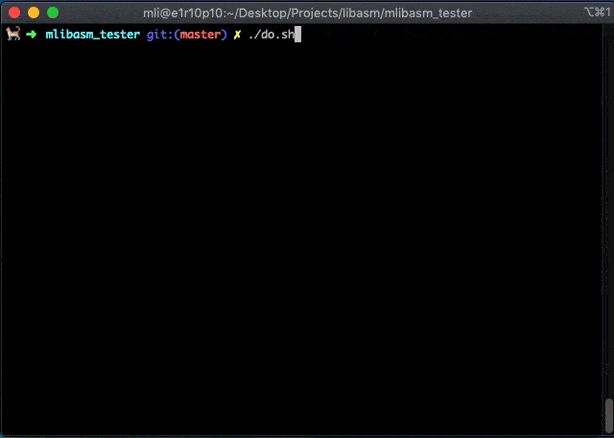

# mlibasm_tester

<p align="center">
        
</p>

## Usage

Go in your libasm repository and :

```bash
git clone https://github.com/mli42/mlibasm_tester.git && cd ./mlibasm_tester/ && ./do.sh
```

To test `errno` on `ft_strdup`:  
`./strdup_kill` and see if `errno == ENOMEM`

Checks leaks by using `/usr/bin/leaks`:  
`#define CHECKLEAKS 0` (in `mlibasm.h`) to disable it

Good news : It will check only what you have coded and compiled with your Makefile

/!\ Warning: If it only prints the header, there is a compilation problem  
Delete the redirections in `do.sh` to see what's really happening

## Functions
- [x] ft_strlen
- [x] ft_strcpy
- [x] ft_strcmp
- [x] ft_write
- [x] ft_read
- [x] ft_strdup

## Bonus (from the piscine)
```c
typedef struct  s_list
{
    void          *data;
    struct s_list *next;
}           t_list;
```
- [x] ft_atoi_base
- [x] ft_list_push_front
- [x] ft_list_size
- [x] ft_list_sort
- [x] ft_list_remove_if

## Links
`kill_malloc` comes from [this repo](https://github.com/ataguiro/mc)
